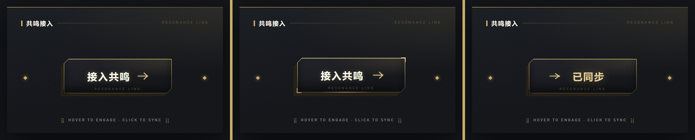
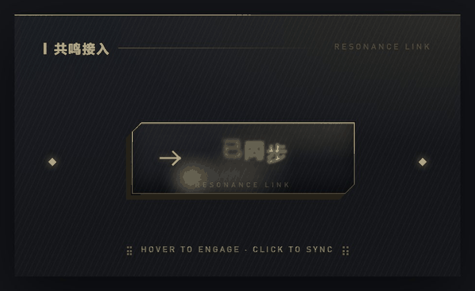

# 把「鸣潮风」拆成一个 skill，然后用一颗网红按钮验证了它

> 上一篇修完桌宠的性能，这篇说另一件事：桌宠的设置面板和人物气质完全不搭，我照着游戏 UI 的感觉重做了一版，过程中发现"风格"其实能列成条目，于是抽成了一个 AI 可执行的 skill。文末用一颗 Uiverse 上的网红紫色按钮做了次换皮实验——skill 没见过这个组件，但规则是可迁移的。

<!-- 【配图1·待补充：桌宠 + 新版深色金调设置面板同框截图。需要你在桌宠项目里打开设置面板，让穗穗站在面板旁边截一张，体现"人物和面板终于是一个世界的东西"】 -->

## 起因：功能没毛病，气质完全不对

桌宠是穗穗，鸣潮的角色。可她的设置面板是我随手写的：浅灰底、白色圆角卡片、一个蓝色主色、`border-radius: 16px` 铺满全场。功能没毛病，但和站在旁边的人物完全是两个世界的东西，像给游戏角色配了一套后台管理系统。

那套游戏界面的气质其实挺好复述：近黑底，金色是唯一的强调色，纯直角，发丝描边，卡片四角带 L 形角标，中文标题下面压一行大字距的英文，滑块和小圆点统一是 45° 转过来的菱形。

照着这个方向改的过程中，我意识到一件事：这些不是"感觉"，是能列成条目的规则。既然能列成条目，就能交给 AI 复用。

<!-- 【配图2·待补充：设置面板新旧对比图，左边浅色圆角卡片版，右边深色金调版。需要你提供旧版面板截图，新版面板直接截桌宠项目当前的设置面板】 -->

## 把感觉翻译成规则

第一步是把颜色钉死。所有值都从实际界面上取样，不允许"差不多的金色"：

```css
:root {
  --gold:        #c9ac67;   /* 品牌金，固定不动 */
  --gold-bright: #e6cf95;
  --gold-dim:    rgba(201, 172, 103, .3);
  --cream:       #fafae9;
  --bg-0:        #14161a;
  --hair:        rgba(201, 172, 103, .2);   /* 发丝描边 */
  --theme:       #d9b45c;   /* 唯一允许随内容变化的槽位 */
}
```

第二步是把装饰元素点名。我数下来有六个反复出现的签名元素：四角 L 形角标、中英双语区块标题、菱形节点、大号数字读数、点阵括号装饰、菱形滑块的硬朗滑杆。单拎出来每个都只有几行 CSS，比如角标：

```css
.card::before, .card::after {
  content: ''; position: absolute;
  width: 9px; height: 9px;
  border-color: var(--gold); pointer-events: none;
}
.card::before { left: -1px;  top: -1px;    border-top: 1.5px solid; border-left: 1.5px solid; }
.card::after  { right: -1px; bottom: -1px; border-bottom: 1.5px solid; border-right: 1.5px solid; }
```

第三步是硬性规则，这部分才是风格的骨头：零圆角；有且只有一个强调色；边框 1px、角标 1.5px，再粗就是廉价 bootstrap 皮肤；辉光只给菱形滑块、大数字和激活态，不上卡片不上正文；扫描纹理透明度必须压在 3% 以下，只做质感，绝不能读出条纹感。

还有一条软规则效果意外地好：命名词汇表。把平铺直叙的设置项翻译成"世界观内"的说法——「设置」是「共鸣终端 RESONANCE TERMINAL」，「音量」是「声压 AMPLITUDE」，「已保存」是「参数已同步 SYNCED」。但破坏性操作不许改名，「删除」就是「删除」。

## 两个具体教训

**切角不是切了就好看。** 鸣潮大量用 45° 切角替代圆角，我给窗口右上角也切了一刀，结果自己看着都别扭，像面板被啃掉一口。原因是那个切口光秃秃的，没有任何东西描出斜边。后来才想清判断标准：切角必须有"边缘表达"。图标框带 `border`，border 会跟着 `clip-path` 一起被裁，自动就描出了斜边；拨杆是实心色块，填色本身就是边缘；而窗口是一大片无边框表面，切完只剩一个豁口。要么单独补一条斜线，要么大面积表面干脆别切。

<!-- 【配图3·待补充：三种切角对比图——带边框的切角（对）、实心色块切角（对）、无边框面板裸切角（错，像破损）。可以从 skill 的 demo.html 里截图标框和开关，裸切角需要临时改一个反例】 -->

**全局主题变量会伤及无辜。** 面板要跟着角色换肤，我把角色主题色写进了 `:root` 的 `--primary`。切到「穗穗·青」之后蓝色主题生效，连另一张金色角色的缩略图底色也一起被染成了蓝的。改法是让每张卡片自己带颜色，别去动根节点：

```js
el.style.setProperty('--c', item.color);   // 逐卡注入，不影响兄弟节点
```

```css
.item .thumb {
  background: linear-gradient(165deg,
    color-mix(in srgb, var(--c, var(--theme)) 32%, #12141a), #12141a);
}
```

品牌金同样不该跟着角色变。游戏里换个角色不会把整个 UI 的金色也换掉。所以我立了条规矩：金色骨架固定，角色颜色只允许注入内容区域，比如缩略图底色。

## 为什么值得做成 skill

是因为我发现自己讲不清"要什么"的时候，AI 默认给我的就是那套浅灰底白卡片圆角蓝主色。它不是不会做设计，是没有参考系。等我把具体的十六进制值、字号比例、还有"哪些写法看着像 bug"都列清楚之后，一次就能出对，而且下个项目直接复用，不用从头解释一遍。前端没有设计师辅助的时候，这就是参考系本身。

skill 叫 `resonance-hud`，MIT 协议，已经开源：

```bash
npx skills add https://github.com/KTBOY/resonance-hud --skill resonance-hud
```

里面三个文件：`SKILL.md` 是令牌和规则，`reference.md` 是标题栏、选择器、开关、分段控件的可复制实现，`demo.html` 在浏览器打开就能看全部组件。零依赖，所有装饰都是 CSS 和内联 SVG 画出来的，不含任何游戏素材，任意 DPI 下都锐利。

<!-- 【配图4·待补充：skill 的 demo.html 组件画廊截图。浏览器直接打开 resonance-hud/demo.html 截全页即可】 -->

## 实验：让它给一颗没见过的按钮换皮

规则写下来了，但有个问题一直悬着：skill 里全是"设置面板"语境的组件——标题栏、选择器、开关、滑杆。换一个它从没见过的组件，规则还成立吗？

我挑了个足够刁钻的对象：Uiverse 上 marcelodolza 那颗很火的紫色按钮。选它是因为动效密度极高——悬停时文字逐字上翻、一圈扫光转起来、箭头三段摆动；按下去周围炸出一圈 SVG 飞溅线条；点击后箭头飞出屏幕再从左侧飞回，文字从 "Join Today" 切换成 "Join Now"，边框上还有一段描边路径跑一圈。而它的视觉语言和 resonance-hud 完全对着干：紫色渐变、18px 大圆角、高斯模糊堆出来的软阴影。


给 AI 的指令就一句话：复刻这颗按钮，风格用 resonance-hud。

### 机制留下，皮肤换掉

拆开看，这颗按钮是"机制"和"皮肤"两层。逐字翻转靠 `animation-delay: calc(var(--i) * 0.03s)` 错开每个字符；飞溅线条靠 `stroke-dasharray` + `stroke-dashoffset` 动画；箭头飞行是一段 `translateX` 关键帧在 50% 和 51% 之间瞬移。这些全是拓扑，和长什么样没关系，原样保留。

皮肤层就是规则逐条落地的过程了：

**圆角归零，切角补上边缘表达。** 原版外壳是 `border-radius: 18px` 加 3px 渐变 padding 假装边框。换成 `clip-path` 对角切 10px，padding 收窄到 1px——这里正好用上前面那条教训：padding 撑出来的"边框"是实心填色，会跟着 clip-path 一起被裁，自动沿切口描线，不需要任何额外处理。

```css
.wrap {
  padding: 1px;   /* 发丝边框，被 clip-path 裁切后自动描出斜边 */
  background: linear-gradient(to bottom, var(--gold), var(--gold-dim));
  clip-path: polygon(10px 0, 100% 0, 100% calc(100% - 10px),
                     calc(100% - 10px) 100%, 0 100%, 0 10px);
}
```

**软阴影换硬阴影。** 原版底座是七层带 `blur` 的紫色阴影堆叠，糖果感的来源。HUD 语境里模糊就是噪声，换成三层无模糊的阶梯式偏移，错位感还在，但边缘是锐的：

```css
box-shadow:
  -6px 6px 0 0 rgba(201,172,103,.14),
  -12px 12px 0 0 rgba(201,172,103,.09),
  -18px 18px 0 0 rgba(201,172,103,.05);
```

**SVG 路径跟着外形走。** 有个容易漏的细节：点击后跑的那圈描边路径，是一个独立 SVG 里手写的圆角矩形 `path`。外壳都改成切角了，这条路径还是圆角的话，动画一跑就穿帮。得把 `path` 的 `d` 重画成切角矩形——`A` 圆弧命令全部换成 45° 的 `L` 直线段。风格迁移不只是改 CSS，内联 SVG 的几何也在管辖范围内。

**文案过词汇表。** "Join Today" 直译是「立即加入」，但词汇表要求世界观内的说法，成品是「接入共鸣」，点击后变「已同步」，底部压一行 7px 的 `RESONANCE LINK`。拉丁标签必须是有意义的翻译，拼音和生造词会让任何看得懂英文的人瞬间出戏。

最后把按钮放进标准面板基底里，配上四角角标、中英双语标题、两侧菱形节点和点阵括号页脚——签名元素凑满，密度本身就是这个风格的一部分。



完整动效看这张（悬停字符翻转 → 按压 → 箭头飞行换字 → 移出复位）：



需要清晰版的话，仓库里还有一份 [MP4 录屏](图片/resonance-button-demo.mp4)。

### 结果

悬停、按压、点击三套动效全部保留，视觉上已经完全是另一个世界的东西。整个过程里我没有写一行样式代码，只在浏览器里逐个状态验收。

这次实验让我确认了一件事：skill 和组件库是两码事。组件库给的是成品，遇到没收录的组件就没辙；skill 给的是判断标准——什么必须保留（单一金色、发丝线宽、切角的边缘表达）、什么必须替换（圆角、模糊、多余色相）、什么容易翻车（裸切角、全局换肤、乱码拉丁文）。标准是可迁移的，所以一颗从没见过的按钮也能一次换对。

## 附：换皮实验的验收清单

从 skill 的验收清单里挑出这次实际用到的几条，改任何组件都通用：

- [ ] 全局无 `border-radius`；所有切角都有边框或实心填色描出切口
- [ ] 有且只有一个强调色相（金）
- [ ] 内联 SVG 的几何形状（路径、描边）与新外形一致，没有残留旧轮廓
- [ ] 拉丁标签是有意义的翻译，不是拼音
- [ ] 扫描纹理透明度低于 3%
- [ ] 动效逻辑零改动——只换令牌和几何，不碰关键帧的时间结构
- [ ] 带 `prefers-reduced-motion` 降级
