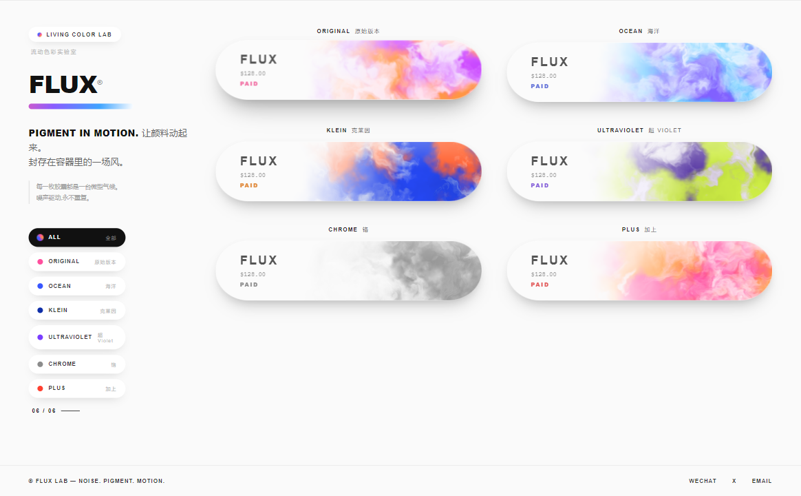
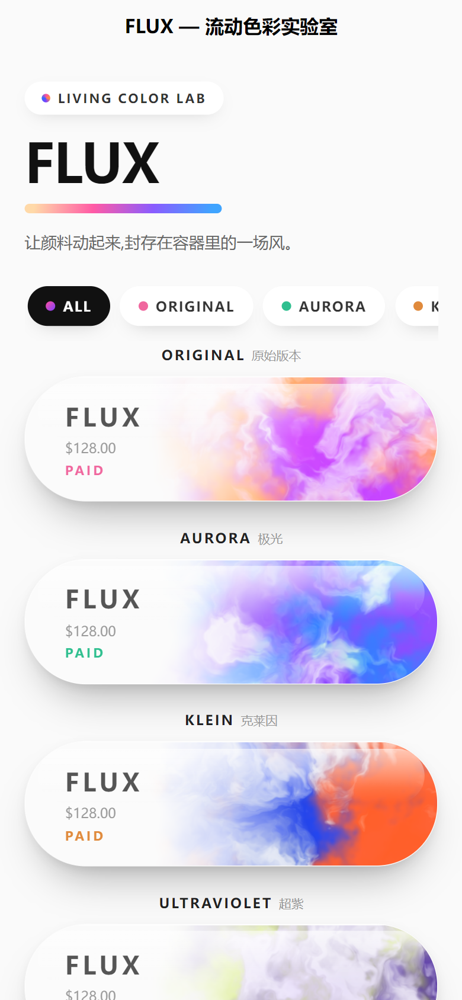
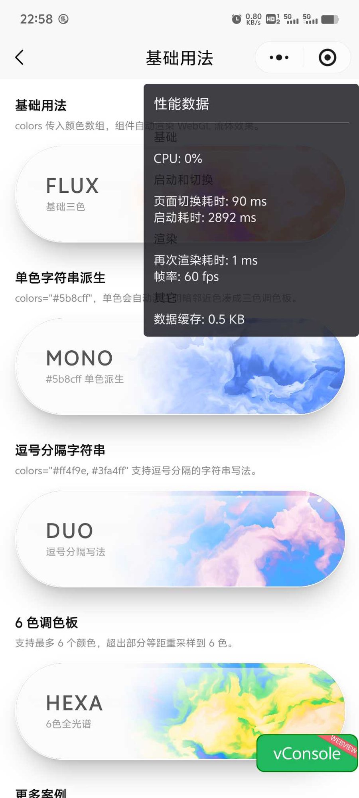
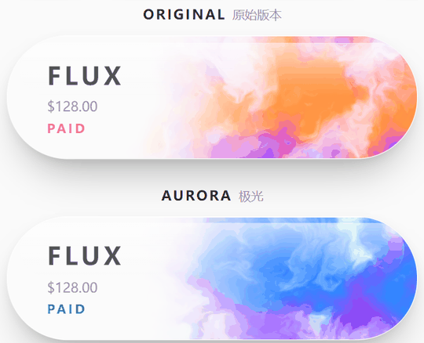

# sk-flux-capsule：我把网页上那团流动的彩色云雾，塞进了微信小程序

> 之前我在网页上做过一个好玩的东西：一颗胶囊形状的卡片，里面的颜色像水彩一样不停流动，鼠标划过去还会跟着加速。很多朋友问能不能在小程序里用。我试了才知道，网页上三行代码搞定的 canvas，到了小程序里完全是另一回事。这篇记录一下这团"云雾"从网页搬进微信小程序的过程，以及我最后把它封装成的组件 `sk-flux-capsule`。


## 一、网页版是怎么做出来的

先说网页版，就是 `lab` 目录里那个单文件页面。

它的效果是：一个药丸形的白色胶囊，里面封着一团彩色烟雾。烟雾不是视频，也不是 GIF，是实时算出来的。每一帧，GPU 都在根据噪声函数重新计算每个像素的颜色，所以它永远在动，又永远不会重复。


原理拆开看其实不复杂：

- 用 WebGL 画一个铺满胶囊的三角形，所有颜色计算都写在片元着色器里，交给 GPU 跑；
- 着色器里用的是"域扭曲 FBM 噪声"，说人话就是两层噪声互相推挤，挤出来的纹理就像水彩晕开；
- 每个主题传三个主色进去，按噪声值在三者之间平滑过渡；
- 左侧留一块渐隐的白给文字，顶部再蒙一层淡淡的白雾，看起来就像 iOS 风格的玻璃胶囊。

整个页面一个 HTML 文件，没有任何依赖，浏览器直接打开就能跑。鼠标悬停卡片，流速会轻轻加快；在胶囊里拖动，烟雾会跟着你的手势翻涌，停下后一秒左右平滑回落。



网页版做出来我自己挺满意。问题随之而来：能不能放进小程序？

## 二、为什么想搬进小程序

原因很实际。网页版再好看，也只能发个链接。而小程序是触手可及的，用户不用装东西、不用记网址，扫一下就在手里。我想做的组件库本来就是面向 uni-app 的，这种有视觉记忆点的组件，正是小程序里缺的。

但真正动手才发现，"把网页代码复制过来"这条路根本走不通。

## 三、搬进小程序，到底难在哪

先给结论：难的不是算法，是"画布"本身。着色器那套逻辑一行没改，改的全是画布的平台差异。

### 1. 小程序里没有你熟悉的 canvas

网页上，`document.createElement('canvas')` 或者模板里写个 `<canvas>`，拿到的就是一个 DOM 元素，`getContext('webgl')` 直接开画。

小程序里没有 DOM。它的 canvas 是一个"原生组件"，你拿不到元素本身，只能通过 `SelectorQuery` 去查，查到的是一个"canvas node"对象。获取方式完全不同：

```js
uni.createSelectorQuery()
  .select('#myCanvas')
  .fields({ node: true, size: true })
  .exec((res) => {
    const node = res[0].node   // 这才是能用的画布对象
  })
```

而且这个查询是异步的，你没法在组件挂载的瞬间就拿到画布，得等布局完成。

### 2. 动画循环的驱动方式不一样

网页上驱动动画用 `window.requestAnimationFrame`，全局可用。

小程序里 `window` 不存在，帧回调挂在 canvas node 上：`node.requestAnimationFrame`。也就是说，你得先拿到 node，才能开始画第一帧。这两件事的先后顺序，在网页上根本不用考虑。

### 3. 一套代码要分两条路走

uni-app 的条件编译在这里帮了大忙。同一份组件代码，用注释标记区分平台：

```js
/* #ifdef MP-WEIXIN */
// 小程序：SelectorQuery 取 canvas node
/* #endif */

/* #ifdef H5 */
// 网页：动态创建原生 canvas
/* #endif */
```

编译到哪个平台，就只保留哪段。我把所有平台差异都收敛进一个 `setupCanvas()` 函数，函数之外的渲染逻辑、交互逻辑，两端完全共用。

### 4. 清晰度要自己管

网页上 canvas 的像素尺寸和 CSS 尺寸不一致时会糊，小程序上更明显。解决办法是按设备像素比（DPR）放大画布的物理分辨率，再封顶到 2，避免高分屏上无谓地烧性能。

### 5. 最担心的还是性能

这是迁移前我最没底的一点。小程序的运行环境比浏览器受限得多，WebGL 在里面跑不跑得动、会不会发烫掉帧，只能实测。

## 四、组件是怎么组织的

踩完坑，我把这个东西收进了 `sk-flux-capsule`，结构上把"平台"和"逻辑"彻底分开：

```text
sk-flux-capsule/
├── sk-flux-capsule.vue   # 视图 + 平台差异（setupCanvas 里分两条路）
└── core/
    ├── color.ts          # 颜色解析：CSS 字符串 → 着色器调色板
    ├── motion.ts         # 交互动力学：按压、搅动、流速缓动
    ├── renderer.ts       # WebGL 渲染器：编译、缓存、释放
    └── shaders.ts        # GLSL 着色器源码
```

`core` 里四个文件是纯逻辑，不碰任何平台 API，网页和小程序共用同一份。平台差异只存在于 `.vue` 文件里那一小段条件编译。

这样做的好处是：以后哪天要支持 App 或者别的端，只需要在 `setupCanvas()` 里再加一条分支，核心的着色器和动力学一行都不用动。

用起来也很简单，传几个颜色进去就行：

```vue
<sk-flux-capsule :colors="['#ff4f9e', '#ff8c40', '#b83dff']" title="FLUX" />
```

单个颜色也可以，组件会自动派生出明暗两个邻近色，凑成有层次的三色：

```vue
<sk-flux-capsule colors="#5b8cff" title="MONO" />
```



## 五、小程序里到底卡不卡

这是大家最关心的，也是我动手前最没底的。直接上微信开发者工具的 Audits 跑分：



几个关键数字：

- 性能评分 96，体验评分 100，都是"优秀"档；
- 运行时 setData 平均耗时 1ms，说明渲染循环没有给逻辑层造成负担；
- 平均内存占用 118MB，峰值 127MB，对一个跑着 WebGL 的页面来说在可接受范围。

实际手感上，云雾稳定流动，拖动跟手，没有明显掉帧。WebGL 在小程序里跑得动，这件事算是验证了。



## 六、几个使用上的提醒

1. 页面里同时放太多实例会吃 GPU。演示页我一开始堆了十几个，低端机明显发热，后来收敛到一屏三四个。
2. 页面切后台记得停帧。组件暴露了 `pause()` / `resume()`，配合 `onHide` / `onShow` 用，避免页面看不见的时候还在烧电。
3. 多个实例想纹理不一样，传不同的 `seed`。不传的话每个实例也会随机错开，不会同步。

## 七、最后

这团云雾从网页到小程序，算法一行没改，改的全是画布的平台差异。把这部分差异收敛进一个函数之后，剩下的事情就变得很纯粹。

组件已经收进 shukelab，源码带完整 TS 类型：

- GitHub：https://github.com/KTBOY/shukelab
- 插件市场：（待发布）

如果你也在做小程序里有点"视觉记忆点"的东西，希望这篇能帮你少踩几个 canvas 的坑。